# Bloodborne research progression DAG

This is the whole research scaffold. The playable slice is a subset of it:
slice 3 ends at the Blood-starved Beast and is specified in
`VERTICAL-SLICE.md`. This graph models candidate later requirements, not a
prescribed walkthrough order. Return shortcuts and travel edges are omitted so
the graph remains acyclic. Chalice Dungeons remain out of scope.

```mermaid
flowchart LR
    Menu --> Dream[Hunter's Dream] --> CY[Central Yharnam]
    CY -->|Oedon Tomb Key + Father Gascoigne defeated| CW[Cathedral Ward]
    CW --> OY[Old Yharnam]
    OY -->|Blood-starved Beast defeated| HCW[Healing Church Workshop]
    CW -->|Hunter Chief Emblem| GC[Grand Cathedral]
    HCW --> GC
    GC --> Hemwick[Hemwick Charnel Lane]
    GC -->|Forbidden Woods Password| FW[Forbidden Woods]
    FW --> Clinic[Iosefka's Clinic]
    FW -->|Shadows of Yharnam defeated| Byrgenwerth
    Byrgenwerth -->|Lunarium Key| Lake["Moonside Lake / Rom"]
    Lake -->|Rom defeated| Yahar["Yahar'gul (Blood Moon)"]
    Yahar -->|The One Reborn defeated; inspect mummy| L2[Lecture Building 2F]
    L2 --> Mensis[Nightmare of Mensis]
    Mensis -->|Micolash defeated| WetNurse[Mergo's Wet Nurse]
    CW -->|Tonsil Stone; Amygdala grab| L1[Lecture Building 1F]
    L1 --> Frontier[Nightmare Frontier]
    CW -->|Upper Cathedral Key; Blood-starved Beast defeated| Upper[Upper Cathedral Ward]
    Hemwick -->|Cainhurst Summons| Cainhurst[Castle Cainhurst]

    CW -->|Password learned + Eye of a Blood-drunk Hunter| HN[Hunter's Nightmare]
    HN -->|Ludwig defeated| UCP[Underground Corpse Pile]
    UCP -->|Eye Pendant| RH[Research Hall]
    RH --> LG[Lumenwood Garden]
    LG -->|Living Failures + Astral Clocktower Key| AC[Astral Clocktower]
    AC -->|Lady Maria + Celestial Dial| FH[Fishing Hamlet]
    HN --> NGC[Nightmare Grand Cathedral]
    NGC -->|Laurence's Skull| Laurence[Laurence]
```

## Wiki audit

| Edge or gate | Result | Evidence |
|---|---|---|
| Gascoigne -> Cathedral Ward | Matches | Two requirements, not one. The door out of the Tomb of Oedon (object 2411304) is the generic key door: `m24_01_00_00.emevd.dcx.js:168` initializes event 12410110 slot 5 with `objParameterId 2410080`, so the item requirement is an ObjActParam property and no `PlayerHasItem` condition exists in EMEVD. The door also sits behind Gascoigne's arena. Vanilla hid the coupling by awarding the key on his death (`:1394`, `AwardItemLot(31000)`); with the key shuffled the edge costs both. |
| Cathedral plaza | **Corrected 2026-08-24** | Hunter Chief Emblem or the Healing Church Workshop route reaches the plaza. The disjunction is real, but modelling it as one two-clause rule made the emblem clause dead: Old Yharnam is free from Cathedral Ward and Blood-starved Beast is free inside it, so the other clause was always satisfiable. It is now two edges — `Cathedral Ward --emblem--> Grand Cathedral` and `Healing Church Workshop --> Grand Cathedral` — which is what the game does and what lets a bounded slice make the emblem matter. |
| Amelia -> Forbidden Woods | **Strengthened 2026-08-30** | Inspecting Laurence's Skull after Amelia remains an AP check, but no longer grants access directly. The independently shuffled Forbidden Woods Password teaches the vanilla password when received and gates the woods door. |
| Forbidden Woods -> Byrgenwerth | Matches | Defeating Shadows of Yharnam opens the path. |
| Byrgenwerth -> Moonside Lake | **Corrected 2026-08-30** | The Lunarium Key opens the second-floor terrace door leading past Willem to Moonside Lake and Rom. Vanilla requires it; only a geometry exploit bypasses the door. The key is now shuffled and its attic-desk award is an AP check. |
| Rom -> Blood Moon Yahar'gul | Matches | Rom's death is the Blood Moon trigger. |
| One Reborn -> Lecture 2F | Matches | Inspecting the mummy after The One Reborn transports to Lecture Building 2F. |
| Tonsil Stone route | Corrected | The Cathedral Ward grab transports to Lecture Building 1F; its door reaches the Frontier. |
| Cainhurst branch | Matches | Cainhurst Summons plus the Hemwick obelisk summons the carriage. |
| Upper Cathedral branch | **Corrected** | The Upper Cathedral Key opens the seal, but the chapel side doors that reach it only open after Blood-starved Beast. The key alone is not sufficient. |
| Hemwick branch | **Corrected 2026-08-18, re-sourced 2026-08-24** | The road to Hemwick starts left of the Grand Cathedral entrance, so it sits behind the plaza. It used to carry a *copy* of the plaza's requirement; it now leaves from the Grand Cathedral itself, so there is one place the plaza rule lives. This edge was modelled as free and **was absent from this table**, which is how it survived the original audit. |
| DLC access | Matches | After Amelia and the altar interaction, the Dream supplies the Eye; the Oedon Chapel grab enters Hunter's Nightmare. |
| Ludwig -> Research Hall | Matches | Ludwig gates the recovery-room route and the Eye Pendant operates its surgery altar. |
| Living Failures -> Clocktower | Matches | Living Failures award the Astral Clocktower Key. |
| Maria -> Fishing Hamlet | Matches | Maria awards the Celestial Dial, which opens the Astral Clock. |
| Laurence branch | Matches | Laurence's Skull, found beneath the surgery altar, enables Laurence's optional fight. |

🛑 **This table is only as good as its coverage.** The Hemwick edge was wrong *and* missing
from the audit, so reviewing the table could never have found it. `tests/test_bloodborne_gates.py`
now holds the machine-checkable half: every entrance must appear in either `DOCUMENTED_GATES`
or `DOCUMENTED_FREE`, so an undocumented edge fails a test rather than going unnoticed.

Primary human-readable sources:

- https://www.bloodborne-wiki.com/2015/08/progression-guide.html
- https://www.bloodborne-wiki.com/2015/03/cathedral-ward.html
- https://www.bloodborne-wiki.com/p/keys.html
- https://www.bloodborne-wiki.com/p/bosses.html
- https://www.bloodborne-wiki.com/2015/09/the-old-hunters.html
- https://www.bloodborne-wiki.com/2015/11/eye-pendant.html

Wiki evidence is semantic corroboration only. Numeric flags, lots, and runtime behavior remain
grounded in extracted game data and live tests.
