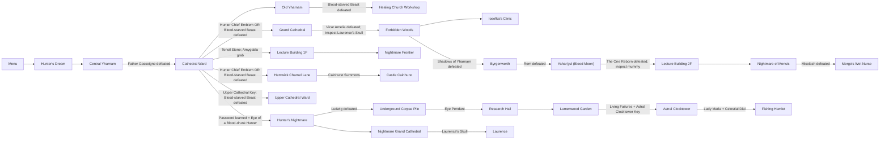

# Bloodborne MVP progression DAG

This is the current base-game reachability graph. It models requirements, not a prescribed
walkthrough order. Return shortcuts and travel edges are omitted so the graph remains acyclic.
Chalice Dungeons are outside MVP scope. Old Hunters is an optional branch and is not required for
the default Wet Nurse goal.

## Wiki audit

| Edge or gate | Result | Evidence |
|---|---|---|
| Gascoigne -> Cathedral Ward | Matches | Gascoigne awards the Oedon Tomb Key and opens Cathedral Ward. |
| Cathedral plaza | Corrected | Hunter Chief Emblem or the Healing Church Workshop route reaches the plaza. |
| Amelia -> Forbidden Woods | Corrected | Amelia must be defeated and Laurence's Skull inspected to learn the password. |
| Forbidden Woods -> Byrgenwerth | Matches | Defeating Shadows of Yharnam opens the path. |
| Rom -> Blood Moon Yahar'gul | Matches | Rom's death is the Blood Moon trigger. |
| One Reborn -> Lecture 2F | Matches | Inspecting the mummy after The One Reborn transports to Lecture Building 2F. |
| Tonsil Stone route | Corrected | The Cathedral Ward grab transports to Lecture Building 1F; its door reaches the Frontier. |
| Cainhurst branch | Matches | Cainhurst Summons plus the Hemwick obelisk summons the carriage. |
| Upper Cathedral branch | **Corrected** | The Upper Cathedral Key opens the seal, but the chapel side doors that reach it only open after Blood-starved Beast. The key alone is not sufficient. |
| Hemwick branch | **Corrected 2026-08-18** | The road to Hemwick starts left of the Grand Cathedral entrance, so it sits behind the plaza and carries the plaza's requirement. This edge was modelled as free and **was absent from this table**, which is how it survived the original audit. |
| DLC access | Matches | After Amelia and the altar interaction, the Dream supplies the Eye; the Oedon Chapel grab enters Hunter's Nightmare. |
| Ludwig -> Research Hall | Matches | Ludwig gates the recovery-room route and the Eye Pendant operates its surgery altar. |
| Living Failures -> Clocktower | Matches | Living Failures award the Astral Clocktower Key. |
| Maria -> Fishing Hamlet | Matches | Maria awards the Celestial Dial, which opens the Astral Clock. |
| Laurence branch | Matches | Laurence's Skull, found beneath the surgery altar, enables Laurence's optional fight. |

🛑 **This table is only as good as its coverage.** The Hemwick edge was wrong *and* missing
from the audit, so reviewing the table could never have found it. `tests/test_bloodborne_gates.py`
now holds the machine-checkable half: every entrance must appear in either `DOCUMENTED_GATES`
or `DOCUMENTED_FREE`, so an undocumented edge fails a test rather than going unnoticed.

Primary human-readable sources:

- https://www.bloodborne-wiki.com/2015/08/progression-guide.html
- https://www.bloodborne-wiki.com/2015/03/cathedral-ward.html
- https://www.bloodborne-wiki.com/p/keys.html
- https://www.bloodborne-wiki.com/p/bosses.html
- https://www.bloodborne-wiki.com/2015/09/the-old-hunters.html
- https://www.bloodborne-wiki.com/2015/11/eye-pendant.html

Wiki evidence is semantic corroboration only. Numeric flags, lots, and runtime behavior remain
grounded in extracted game data and live tests.
