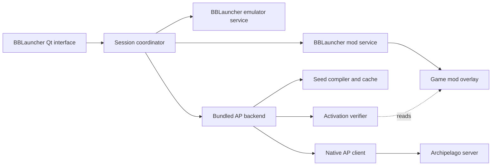

# Spec: Bloodborne launcher with Archipelago built in

Status: **proposed design; no fork implementation or gameplay acceptance claimed**.
Owner: 4laric. Date: 2026-09-22.

## Product decision

Build a small, maintained fork of BBLauncher with Archipelago as a first-class
play mode. Reuse BBLauncher's game setup, emulator controls and mod management,
and our existing AP preparation and client backend. The normal journey becomes
**choose seed → Play**, in one application. Activation, verification, process
attachment and connection happen behind that action.

Bloodborne already has a high setup hurdle outside our control. Every additional
choice, handoff and recovery step we introduce must justify its existence.
Correctness checks remain; the application does the work of satisfying them.

The existing companion stays available during migration and as an advanced
fallback. This design replaces its ordinary two-launcher player journey.
Ordinary users do not enable a development-candidate checkbox: distributed builds
carry an explicitly accepted compatibility set, and unsupported builds explain
the mismatch without offering a safety-check bypass.

## Player experience

For someone with a working BBLauncher installation:

1. Open the fork. It detects existing setup and offers **Use this setup**, showing
   the game and emulator version. Ask which installation only if ambiguous.
2. Choose **Archipelago**, drop in a seed ZIP, and choose a player only if the seed
   has multiple Bloodborne slots. Ask for the server only if trusted seed metadata
   does not supply it; request a password only when needed.
3. Press **Play**. Preparation, activation, verification, Bloodborne startup and
   AP client connection run as one operation, with understandable progress.

On subsequent visits, remember the game, seed, player and server. The normal
action is **Play**. For an already-running verified session it becomes **Return
to game**, with safe automatic client reconnect.

For new installations, retain BBLauncher's setup facilities and present one
missing prerequisite at a time: **Choose your Bloodborne folder** or **Install
shadPS4**. We cannot supply game files or guarantee unsupported hardware; we can
identify what is missing without asking the player to assemble internal paths.

```text
Bloodborne                           Game and emulator setup: Ready

[ Regular play ] [ Archipelago ]

Evening hunt
Player: Alaric       Server: archipelago.gg:12345
[ Change seed ]     [ Connection settings ]

[ Play ]
Ready to play

Mods    Emulator settings    Help
```

The session title is a friendly local name, not a cache hash. Receipts, manifests,
process plans and suppression paths are internal. Logs and provenance remain
available under Help / Diagnostics. Require keyboard navigation, visible focus,
text alongside colors and usable layouts at 820 × 620 logical pixels. Long paths
and translated text must wrap or have an accessible detail view.

| Situation | Player sees | Behavior / recovery |
| --- | --- | --- |
| Building files | Preparing your seed, with a named stage | Reuse valid cache; show measurable progress only where available. |
| Activating | Setting up your game | Journal mutations; prevent duplicate launch or concurrent changes. |
| Title screen/loading | Waiting for your character | Neutral status; never ask the player to consume an item. |
| Game and delivery ready | Connected / Ready | Require verified readiness, not merely a live process. |
| Room unavailable | Reconnecting to Archipelago | Retry with backoff; offer Edit connection, without rebuilding. |
| File conflict | This mod conflicts with Archipelago: name | Offer Disable conflicting mod and play only with an exact reversible plan. |
| Changed game files | Your game setup changed | Explain the change; offer Prepare again; preserve the previous usable build. |
| Interrupted activation | Finishing setup recovery | Recover automatically when unambiguous; otherwise offer a specific restoration. |
| Unsupported version | This version is not supported yet | Identify the supported version and a concrete selection/download action. |

Red means intervention is required and must include a recovery action. Loading,
reconnecting and first inventory discovery are ordinary waits. Elapsed time alone
must not imply corruption. Normal progress and success do not use modal dialogs.
Errors survive status refreshes until resolved; successful recovery clears them.

## First-release scope

Windows x64; the validated game serial/version; directory game installs;
standard-user **copy activation**; a compatible existing or bundled shadPS4;
joining supplied AP seeds; remembered sessions; regular-play switching;
conflict handling; diagnostics; managed updates. No installed Python or Cheat
Engine requirement. Retain current game/client contracts initially.

Later: create/host seeds in the same window, room-page import, more platforms,
symlink activation and richer session libraries. Seed ZIP import is the MVP:
do not assume an AP server exposes a downloadable seed package. Do not promise
arbitrary-mod merging, save conversion, game acquisition or untested emulators.
A complete BBLauncher visual rewrite is not a dependency.

Normal Play authorizes preparation, replacement of this launcher's previous AP
package, verified startup and connection. Ask only for meaningful choices:
ambiguous installation/player, stopping a running game, disabling a named
third-party mod, or recovery that could discard user changes. Never auto-close
an unrelated emulator or silently overwrite another mod.

## Source baseline and required changes

Inspected upstream commit:
[`ca12c2fc38b8ba485e508bde815e8ea8cb49ac10`](https://github.com/rainmakerv3/BB_Launcher/tree/ca12c2fc38b8ba485e508bde815e8ea8cb49ac10).
AP repository baseline: `f49482fc0f588b6701226186c09cb0ca0cd5e2cd`.
This upstream snapshot is newer than the `f092023` builds in our companion
experiments. Their evidence and executable allowlist do not automatically cover
the fork. Current acceptance status remains in [BBLAUNCHER.md](BBLAUNCHER.md).

| Existing implementation | Required treatment |
| --- | --- |
| [ModManager.h](https://github.com/rainmakerv3/BB_Launcher/blob/ca12c2fc38b8ba485e508bde815e8ea8cb49ac10/modules/ModManager.h), [ModManager.cpp](https://github.com/rainmakerv3/BB_Launcher/blob/ca12c2fc38b8ba485e508bde815e8ea8cb49ac10/modules/ModManager.cpp) | Activation/deactivation are private dialog slots coupled to selection, widgets and message boxes. Extract a reusable service; do not automate button clicks. |
| Upstream activation | Moves packages and backs up/replaces individual files; Windows copy/symlink behavior depends on the build. Add operation planning, journaling and crash tests. Existing success paths do not establish transaction-level recovery. |
| [bblauncher.cpp](https://github.com/rainmakerv3/BB_Launcher/blob/ca12c2fc38b8ba485e508bde815e8ea8cb49ac10/modules/bblauncher.cpp) | Existing emulator IPC and RunGame/RestartEmulator paths need AP preflight on every startup route. Capture the actual spawned process identity. |
| [main.cpp](https://github.com/rainmakerv3/BB_Launcher/blob/ca12c2fc38b8ba485e508bde815e8ea8cb49ac10/main.cpp) | Inspected CLI includes no-GUI mode, not an AP service contract. Add explicit integration APIs. |
| [CheckUpdate.cpp](https://github.com/rainmakerv3/BB_Launcher/blob/ca12c2fc38b8ba485e508bde815e8ea8cb49ac10/settings/updater/CheckUpdate.cpp) | Hardcoded upstream release/compare endpoints must become the fork's channel; an update must not replace the fork with upstream BBLauncher. |
| [external_workflow.py](../bb_launcher/external_workflow.py), [external.py](../bb_launcher/external.py) | Reuse immutable export, activation verification, fresh-boot proof and client-only connection. Add a separately validated fork identity path; never bypass existing exact-build checks. |
| [workflow.py](../bb_launcher/workflow.py), [client_config.py](../bb_launcher/client_config.py) | Reuse preparation, cache, runtime config and durable namespaces. Do not port gameplay rules or delivery into Qt. |

## Architecture and ownership



- Qt owns player choices, accessibility, progress and recovery actions.
- The coordinator owns sequencing, operation identity, per-install locking,
  cancellation and recovery. It never parses human-readable logs as an API.
- BBLauncher's mod service is the **sole writer** of active mod folders, overlay
  files and conflict backups. Both Mod Manager and AP mode use it and its locks.
  AP-owned files cannot go through Mod Merger.
- BBLauncher's emulator service starts/stops its emulator and returns executable,
  PID and process creation identity. All launch/restart/IPC shortcuts use it.
- The AP backend owns preparation, internal receipts/index, boot observations,
  runtime configuration, ledgers and client supervision. It does not activate
  mods or fabricate standalone ownership manifests for BBLauncher files.
- The native client retains game attachment, AP identity validation and durable
  delivery/check behavior. It remains a separate process.

Ship a frozen backend with the launcher. First add a machine-readable entry point
to our existing application and reuse packaging/toolchains; a dedicated GUI-free
binary can follow without becoming a second release source of truth.

### Proposed protocol and durable phase boundaries

This is a **new API**, not existing functionality. Use a QProcess-managed local
backend with versioned JSON-lines on stdin/stdout. Stdout is protocol-only;
logs use stderr/files. Requests/events carry protocol version, operation ID and
sequence. Spawn with argument arrays, not a shell. No passwords in arguments or
logs; optional persistence uses the OS credential store.

| Operation | Result / boundary |
| --- | --- |
| capabilities | Protocol and world/runtime/client compatibility, supported games/builds and operations; refuse incompatible mutation. |
| inspect_install / inspect_seed | Read-only prerequisite report and eligible player slots; trusted connection defaults if available. |
| prepare_play | Opaque play ID, display seed/slot and validated package handle; progress and verified cache reuse. |
| Native activate_package | BBLauncher plans and commits activation; backend never writes its overlay. |
| verify_and_arm | Resolve internal receipt, verify exact activation and selected identity with game stopped; persist boot proof and return opaque arm ID. |
| Native start_game | Start only after arming succeeds; return actual process identity. |
| connect_and_start_client | Resolve arm, recheck installed bytes and fresh game process, write runtime state, perform final checks and spawn/reuse the exact matching client. |
| session_status / stop_client / cancel_operation | Typed health; stop only this session's owned client; acknowledge cancellation only at a safe boundary or report recovery. |

Qt passes opaque handles rather than constructing receipt paths. Structured errors
carry a stable code, relevant object IDs, retryability and recovery choices; Qt
provides player-facing copy. The protocol cannot run arbitrary commands.
Validate paths, reparse points and digests at the package handoff: a display name
is not authorization. Keep final verification and AP client spawning inside the
backend to avoid a handoff gap.

Persist play-ID-to-receipt mappings atomically outside mod trees. Add idempotent
package reuse: the current exporter refuses an existing target. Reuse only an
exactly validated artifact; never overwrite an active package to retry a build.
Identical byte caches can belong to different seed/slot identities, so package
bytes never replace the receipt as the session authority. Keep ledgers keyed by
seed and slot, independently of build-cache identity.
Resolve play IDs by validated receipt identity, never package name/path alone;
slot-name normalization and identical byte caches can produce the same package
name for different selected identities.

The reused verifier currently accepts copy, symlink and mixed installations.
The fork's first-release policy must additionally require every verified file's
`installation` to be `copy`. Reject mixed/symlink activation before arming or
connection, with fixtures proving that boundary. Reusing the verifier does not
by itself enforce the narrower support policy.

### Play state machine

`Inspect → Prepare → Plan activation → Activate → Verify/arm → Start → Connect → Playing`

Every step is resumable or explicitly recoverable. Duplicate Play reuses the
active operation. Cache reuse still checks changed inputs. Immediately before
mutation, check that the game is stopped and the plan still matches filesystem
state. Before connection, check process creation identity and installed bytes;
a PID alone is insufficient. Restart, no-GUI startup, IPC and shortcuts cannot
bypass AP preflight.

Target behavior is that a locally verified game can start while AP reconnects,
with delivery/check transmission held until the native client validates room/slot
identity. Validate offline/reconnect semantics before exposing this behavior.
Do not invent another delivery queue in Qt. Until supported, show a recoverable
connection wait while preserving preparation; do not force another build.

## Activation, cancellation and recovery

Acquire a shared per-install lock across fork UI, backend and mod service. Detect
original BBLauncher before modifying its managed installation: it does not know
our lock. External writes remain possible, so recheck fingerprints at boundaries.

Plan the entire change first: selected and prior AP packages, third-party
conflicts, backup space and reverse restoration order. Journal outside movable
mod folders, recording expected before/after bytes and each committed mutation.
Renames within a filesystem may be atomic; cross-filesystem copies are not.
Do not describe the whole multi-file activation as an atomic filesystem swap.

A failed/cancelled build keeps the previous usable package. Failed activation
restores only files with established ownership and expected bytes. If the user
changed a file since interruption, report that conflict rather than overwrite it.
Never use whole-install reset as a generic repair. A crash after activation does
not authorize connection: replay verification and recover persisted arm/process
proof, or require a fresh boot when it cannot be established.

Switching seed while playing offers **Quit game and switch seed**. Never mutate
under a running game. Do not silently deactivate unrelated mods. Preserve
reverse-order deactivation constraints. Switching to **Regular play** removes the
AP package through the same service and retains unrelated mods; do not call this
vanilla when other mods remain active.

### Process lifetime

The QProcess command backend and persistent session supervisor have distinct
lifetimes. The backend launches the supervisor independently before client startup;
destroying the GUI's QProcess must not destroy that supervisor. Reattachment uses
an authenticated local channel restricted to the current OS user, with session
identity checks. This supervisor and its recovery protocol are new implementation
work, not a capability assumed from the current companion.

Closing the window during play defaults to tray minimization. Provide **Quit
launcher and keep playing**: detach the verified game and session supervisor;
the supervisor retains client ownership and ends its client when that game exits.
GUI failure must not kill Bloodborne or erase delivery state. Reopening discovers
and verifies the session before offering Return to game. Stale PID files are not
proof. A supervisor crash requires fresh process/activation checks on recovery.

Retain native interrupted/ambiguous grant rules. Retrying Play, reconnecting or
recovering the UI never authorizes reissuing an item. There is no unconditional
retry-grant repair action.

## Migration and updates

Keep the original executable intact. Use a distinct fork configuration/update
identity. Import settings explicitly into one selected managed installation;
do not duplicate an active mod tree into two managers and imply both own it.
Record migration reversibly and expose a restore path. Before using an existing
active stack, inspect its backup/conflict metadata and reject ambiguous ownership.

Recognize companion receipts, cache and seed/slot state in the AP state root.
Reference/import those records without moving ledgers into mod folders or
resetting history. Revalidate the fork identity and activation. An old
exact-executable receipt may require re-export, but its seed/slot ledger survives.
Standalone AP ownership needs an explicit checked transition before BBLauncher
adopts the overlay. Do not relocate or convert saves.

Update a coherent bundle: fork, backend, client and required tools. Record pinned
provenance in a signed release manifest. Keep the last usable bundle for rollback.
Never update the emulator/backend mid-session. Rebuild only when changed inputs
require it. State migrations need versioning, backups and a tested rollback path;
otherwise refuse rollback rather than opening incompatible state. Redact secrets
from shared diagnostics.

Drafts stay collaborator-only until accepted. Public builds use distinct branding
and an independent update feed; do not imply upstream endorsement.

## Licensing and maintenance

Upstream headers specify GPL-3.0-or-later and include
[the GPL license](https://github.com/rainmakerv3/BB_Launcher/blob/ca12c2fc38b8ba485e508bde815e8ea8cb49ac10/LICENSE).
Preserve notices, identify modifications and distribute corresponding source and
build instructions with binaries as required. Inventory Qt, bundled dependencies,
assets and our backend/client licenses before packaging. Resolve missing grants;
public source availability is not itself redistribution permission. Review fork
branding separately. A process boundary is an engineering decision, not a claim
that licensing obligations disappear.

Separate generic service extraction from AP-specific changes so it can be offered
upstream. Pin the baseline and review upstream activation, backup, configuration
and IPC changes against integration tests. Avoid a second game-data compiler or
delivery implementation. A fork creates ongoing maintenance responsibility.

## Phases and acceptance

| Phase | Deliverable | Gate |
| --- | --- | --- |
| 0. Baseline | Fork identity, reproducible build, license/dependency inventory, own updater | Clean-machine build; source provenance; upstream cannot overwrite fork. |
| 1. Services | Mod/emulator service extraction, AP protocol, coordinator with fake processes | Preserve existing Mod Manager behavior; protocol, cancellation and failure tests. |
| 2. Simulated player journey | Qt AP page, seed/player inspection, automatic preparation/activation, remembered sessions | Fake-install end-to-end journey needs no receipt, internal path or manual Mod Manager handoff. |
| 3. Recovery/import | Activation journal, companion-state import, restart recovery, regular-play switching | Crash at every mutation boundary; preserve ledgers/unrelated files; detect competing managers. |
| 4. Live acceptance | Exact supported Windows copy-route combination | Controlled matrix below, with evidence; companion experiments do not substitute. |
| 5. Distribution | Signed bundle, source, diagnostics, update/rollback and player documentation | Fresh-machine usability check; release-manifest checks; accepted live evidence and owner approval of draft. |

Each phase is independently reviewable. Most UI and orchestration work proceeds
without a live game. Implementation issues can be created from these phases once
the design is accepted. This spec does not create a fork or alter an installation.

### Tests that do not require Bloodborne

- Detect fixture installs without manual paths; resolve genuine ambiguity once.
- Single-slot seeds need no player question; multi-slot choice is remembered by
  seed. Server edits cannot silently change seed/player.
- First play requires setup selection, seed selection and Play; subsequent play
  requires Play only. Count actions in local usability tests, not telemetry.
- Measure cold/warm preparation and verify cache reuse before setting
  hardware-dependent timing promises. Show accurate stage progress.
- Waiting stays neutral. Invalid setup gets a named problem and recovery action
  before mutation. Invalid/stale/forged metadata cannot authorize connection.
- Copy activation reproduces wrapper stripping; reject case collisions, active
  mod collisions, dangling/escaping links and unexpected reparse points.
- Crash/cancel at every receipt, package, index, activation, arm, config and
  process-spawn boundary; resume or restore without base/update changes, ledger
  loss, duplicate clients or unrelated-mod deletion.
- Same byte cache with different seed/slot keeps separate durable histories.
- Stale PIDs, wrong command lines/builds, activation drift and old client
  capabilities fail closed. Restart/IPC cannot skip verification.
- Updates cannot use upstream's feed or replace running components. Test rollback
  with persisted state, not just executable files.
- Keyboard-only and small-window paths remain usable, including error recovery.
  Ordinary screens never require receipts, Cheat Engine or consumable use.

### Acceptance that still needs Bloodborne

Register controlled tests under [the live-probe policy](CONTRIBUTING-LIVE-PROBES.md).
On the exact fork/backend/client/emulator/game combination, verify copy activation;
fresh-process checks; title/loading/character readiness without consumption;
connect/receive/check; save/restart/reload without duplicates; room transitions;
server outage/reconnect; GUI/client restart; seed switch and regular-play restore;
conflicting and compatible third-party mods; interrupted activation recovery;
and unchanged base/update hashes. Use backups/test saves as appropriate.
Do not infer symlink or other platform support from a successful copy-route test.

## Phase-zero investigations

Recommended defaults are above. Resolve the precise supported emulator version,
dependency redistribution terms, migration of an already-active original mod
stack, and whether upstream will accept the generic service extraction. These are
engineering investigations, not extra questions for players. If upstream provides
an adequate extension interface, reconsider the fork while retaining the same
one-window flow and ownership guarantees.
